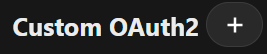

# Install-Nextcloud-on-Ubuntu-Server-using-Docker
Install nextcloud on ubuntu server with docker integrate onlyoffice and zoho login


## Required
1. Ubuntu server 22.04.5 
2. Docker and Docker compose


## Step 1: Create docker compose file

### Create folder nextcloud
``` 
mkdir -p nextcloud
cd nextcloud/
```

### Create docker compose file
```
touch docker-compose.yml
nano docker-compose.yml
```

### Copy this code to docker compose file
```
version: '3.8'
services:
  nginx:
    image: nginx:latest
    restart: always
    ports:
      - "80:80"
    volumes:
      - ./nginx/nginx.conf:/etc/nginx/nginx.conf:ro
    depends_on:
      - nextcloud
      - onlyoffice

  nextcloud:
    image: nextcloud:28.0.10-apache
    restart: always
    volumes:
      - ./nextcloud_data:/var/www/html
    links:
      - db
    environment:
      - MYSQL_PASSWORD=admin
      - MYSQL_USER=admin
      - MYSQL_DATABASE=nextcloud
      - MYSQL_HOST=db
      - TRUSTED_PROXIES=nginx
    depends_on:
      - db

  db:
    image: mysql:8.0.27
    restart: unless-stopped
    environment:
      - MYSQL_ROOT_PASSWORD=root_password
      - MYSQL_PASSWORD=admin
      - MYSQL_USER=admin
      - MYSQL_DATABASE=nextcloud
    volumes:
      - ./db_data:/var/lib/mysql

  onlyoffice:
    image: onlyoffice/documentserver:8.1.0
    restart: always
    environment:
      - JWT_SECRET=adminlocal123a@
    ports:
      - "81:80"
```

### Create file nginx.conf

```
mkdir -p nginx
touch nginx/nginx.conf
nano nginx/nginx.conf
```

#### Copy this code to nginx.conf
```
worker_processes auto;

events {
    worker_connections 1024;
}

http {
    upstream nextcloud {
        server nextcloud:80;
    }

    upstream onlyoffice {
        server onlyoffice:80;
    }

    include /etc/nginx/mime.types;
    default_type application/octet-stream;

    sendfile on;
    keepalive_timeout 65;

    client_max_body_size 512M;

    server {
        listen 80;
        server_name _;

        # Nextcloud
        location / {
            proxy_pass http://nextcloud;
            proxy_set_header Host $host;
            proxy_set_header X-Real-IP $remote_addr;
            proxy_set_header X-Forwarded-For $proxy_add_x_forwarded_for;
            proxy_set_header X-Forwarded-Proto $scheme;

            # Websocket support
            proxy_http_version 1.1;
            proxy_set_header Upgrade $http_upgrade;
            proxy_set_header Connection "upgrade";
        }

        # ONLYOFFICE
        location /onlyoffice/ {
            proxy_pass http://onlyoffice/;
            proxy_set_header Host $host;
            proxy_set_header X-Real-IP $remote_addr;
            proxy_set_header X-Forwarded-For $proxy_add_x_forwarded_for;
            proxy_set_header X-Forwarded-Proto $scheme;
        }
    }
}
```

## Step 2: Start docker container

```
docker compose up -d
```

> [!IMPORTANT] 
> You need to wait about some minutes for the containers to start successfully!

## Step 3: Create admin account


You enter your admin account and click install and wait until create successfully!

## Step 4: Integrate onlyoffice

After login with your admin account.

### 1. Download onlyoffice
Click to your account logo  
on the top right > apps >  > 
enter **onlyoffice** you will see 


Click **Download and enable**.

### 2. Config onlyoffice
Click to your account logo  
on the top right > **Administration settings** > **ONLYOFFICE** on the left bar under **Administration**.


**192.168.81.44** is ip of your server and **81** is your port config in docker compose file.

**Secret key** is your **JWT_SECRET** value in docker compose file.

> [!NOTE]
> Sometime it show **https://help.nextcloud.com/t/an-error-occurred-while-trying-to-connect-an-error-occurred-in-the-document-service-error-while-downloading-the-document-file-to-be-converted-version-8-0-1-31/188336**.
> You need to diable **onlyoffice** and enable it to make it work


## Step 5: Integration to login Nextcloud with Zoho account

### 1. Register your nexcloud to Zoho

1. Go to **API zoho console** https://api-console.zoho.com/
2. Click **ADD CLIENT**
3. Choose **Server-based Applications**
4. Type **Client Name** you want to naming. Example: **Nextcloud**
5. In **Homepage URL** you type your nextcloud ip or dns. Example: `http://192.168.81.44`
6. In **Authorized Redirect URIs** type your auth redirect url. Example: **http://192.168.81.44/apps/sociallogin/custom_oauth2/zoho**
7. Click **Create** you will get **Client ID** and **Client Secret**


### 2. Enable social login in Nextcloud

Click to your account logo  
on the top right > apps >  > 
enter **social login ** you will see 

 

Click **Download and enable**.

### 3. Config Custom OAuth2 for Zoho

Click to your account logo  
on the top right > **Administration settings** > **Social login** on the left bar under **Administration**.

Click  to create new **Custom OAuth2**

- **Internal name** you naming you want. Example **Zoho**
- **Title** you naming you want. Example **Zoho**
- **API Base URL** type Zoho base url **https://accounts.zoho.com/oauth/v2**
- **Authorize url** type Zoho auth url **https://accounts.zoho.com/oauth/v2/auth**
- **Token url** type Zoho token url **https://accounts.zoho.com/oauth/v2/token**
- **Profile url** type Zoho user url **https://accounts.zoho.com/oauth/user/info**
- **Client id** type your Client id you get when register in `Zoho`
- **Client secret** type your Client secret you get when register in **Zoho**
- **Scope** type your Zoho scope to read user info **AaaServer.profile.READ**
- **Groups claim** you can type or not **groups**
- Click **Save**

> [!IMPORTANT] 
> Because response Zoho return when get user info like
 is not exist in custom oauth2 default of nextcloud so we need to edit in code.

Response Zoho return to nextcloud when get user info:
 ```
ZUID: <your id>
Display_Name: <your display name>
Email: <your email>
...
 ```

Edit files 
```
 sudo nano nextcloud_data/custom_apps/sociallogin/lib/Provider/CustomOAuth2.php
 ```

add this line
```
?? $response->ZUID
```
below line (about line 55)
```
?? $response->client_id 
```

and this line 

```
?? $response->Display_Name
```
below line (about line 64)
```
?? $response->name
```

> [!NOTE] If you use https you need to add ``` 'overwriteprotocol' => 'https',``` to file **nextcloud_data/config/config.php**

After config as above you restart containers with
```
docker compose down
docker compose up -d
```

And now your nextcloud was ready.